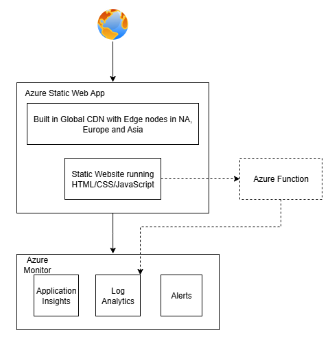

# Azure Microsite - Terraform CDK

A production-ready public microsite built with Azure Static Web Apps and managed with Terraform CDK.

## 🏗️ Architecture



This microsite is built on Azure Static Web Apps with a comprehensive monitoring and security stack:

- **Static Web Apps**: Provides global CDN, automatic HTTPS, and integrated CI/CD
- **Application Insights**: Real-time performance monitoring and user analytics
- **Log Analytics**: Centralized logging and querying capabilities
- **Key Vault**: Secure storage for secrets, certificates, and keys
- **Azure Monitor**: Automated alerts and operational dashboards

For detailed architecture documentation, see [docs/architecture.md](./docs/architecture.md).

## 💰 Cost Analysis

| Service | Monthly Cost | Usage Assumption |
|---------|-------------|------------------|
| Static Web Apps | $0.00 | Free tier (100GB bandwidth) |
| Key Vault | $0.03 | <10,000 operations |
| Application Insights | $0.75 | <1GB telemetry |
| Log Analytics | $0.50 | <500MB logs |
| Storage Account | $0.20 | <1GB storage |
| **Total** | **$2.98** | **Under $5 target** |

*Assumptions: Low traffic site (~1000 page views/month)*

## 🚀 Quick Start

### Prerequisites
- Node.js 18+
- Azure CLI
- Terraform CDK CLI
- GitHub account

### Setup
1. **Clone and install dependencies:**
   ```bash
   git clone <repository-url>
   cd micrositedemo
   npm install
   ```

2. **Configure Azure authentication:**
   ```bash
   az login
   az account set --subscription "<your-subscription-id>"
   ```

3. **Initialize Terraform CDK:**
   ```bash
   cdktf get
   npm run build
   ```

4. **Deploy infrastructure:**
   ```bash
   npm run deploy
   ```

## 🔧 Development Workflow

### Local Development
```bash
# Build TypeScript
npm run build

# Synthesize Terraform configuration
npm run synth

# Plan deployment
cdktf plan

# Deploy to staging
cdktf deploy --auto-approve staging

# Deploy to production (requires approval)
cdktf deploy production
```

### CI/CD Pipeline
- **Pull Request**: Runs tests, linting, security scans
- **Merge to main**: Deploys to staging automatically
- **Manual trigger**: Deploys to production with approval

## 🛡️ Security Features

- **HTTPS Enforcement**: All traffic redirected to HTTPS
- **Security Headers**: CSP, HSTS, X-Frame-Options
- **WAF Protection**: Basic attack prevention
- **Secret Management**: Azure Key Vault integration
- **Access Control**: Managed identities for service auth

## 📊 Monitoring & Observability

### Key Metrics
- **Uptime**: 99.9% SLA monitoring
- **Performance**: <2s page load time globally
- **Errors**: Real-time 4xx/5xx tracking
- **Cost**: Daily spend monitoring with alerts

### Dashboards
- **Operational**: Real-time health and performance
- **Business**: Traffic, conversions, user behavior
- **Cost**: Resource utilization and spend tracking

### Alerts
- Site down (>5min outage)
- High error rate (>5% for 10min)
- Slow performance (>3s load time)
- Cost threshold exceeded ($4.5/month) - deployed manually

## 🔄 Day 2 Operations

### Incident Response
1. **Detection**: Automated alerts via email/Slack
2. **Triage**: Check dashboards and logs
3. **Resolution**: Follow runbook procedures
4. **Post-mortem**: Document lessons learned

### Maintenance
- **Weekly**: Review performance metrics
- **Monthly**: Security and dependency updates
- **Quarterly**: Cost optimization review

### Scaling
- **Traffic spikes**: CDN handles automatic scaling
- **Global expansion**: Add new CDN endpoints
- **Feature growth**: Extend with Azure Functions

## 📁 Project Structure

```
├── src/
│   ├── main.ts              # CDK app entry point
│   ├── stacks/
│   │   ├── microsite-stack.ts   # Core infrastructure
│   │   └── monitoring-stack.ts  # Observability
│   └── constructs/
│       ├── static-site.ts       # Static Web App construct
│       └── monitoring.ts        # Monitoring construct
├── website/
│   ├── index.html           # Main marketing page
│   ├── css/style.css        # Optimized styles
│   └── js/app.js           # Progressive enhancement
├── .github/workflows/       # CI/CD pipelines
├── docs/                   # Technical documentation
└── terraform/              # Generated TF configs
```

## 🔍 Troubleshooting

### Common Issues
- **Deployment fails**: Check Azure subscription permissions
- **Site not loading**: Verify DNS and CDN configuration
- **High costs**: Review resource usage in Azure portal
- **Performance issues**: Check CDN cache status

### Support Resources
- [Azure Static Web Apps Documentation](https://docs.microsoft.com/en-us/azure/static-web-apps/)
- [Terraform CDK Documentation](https://learn.hashicorp.com/tutorials/terraform/cdktf)

---

**Next Steps:**
1. Customize marketing content in `website/`
2. Configure custom domain in Azure portal


## Napkin Design

**Functional Requirements:**
- Should support adding announcements of Ads initiatives
- Should support updates to announcements
- Should be publicly accessible
- The code should be available on open source
**Non Functional Requirements:**
- Support an Availability of 99.95%
- Support a max latency of x in the North America and Europe regions
- Support a max latency of y(y>=x) in other regions
- Total infrastructure cost at low traffic should be under 5$ per month
- Operators should be able to monitor logs, metrics
- Should have alarms that trigger in the event of availability or security incidents to keep
- Should follow all security best practices to ensure no sensitive data is exposed

**Design**
Major Components:
All components will be managed and deployed using Terraform CDK since it offers using familiar programming languages to define and provision infrastructure. Allows for uint tests
Hosting Options
   Azure App service - NOT CHOSEN
   App Service provides fully managed hosting for web applications including websites and web APIs.
   Pros:
   - High level of Abstraction so focus can be on service code with minimum maintenance
   - Optimized for web applications and provides automatic scaling, load balancing
   - Use case meets current requirements for a simple announcements microsite
   - Supports features like A/B Testing out of the box
   - Provides TLS termination and CORS out of the box
   - Provides built-in authentication and authorization features
   Cons:
   - Less granular control over scaling and container specification
   - Higher cost for low TPS - Basic plan B1 would cost ~ $13.140/month
   - Overly complicated for website that currently is expected to be mostly static

   Azure Container Apps - NOT CHOSEN
   Azure Container Apps is a serverless platform that allows you to maintain less infrastructure and save costs while running containerized applications.
   Pros:
   - A cost effective option for lower TPS which is the expectation for this website
   - Provides dynamic scaling by default
   - Supports features like A/B Testing out of the box
   - Provides TLS termination and CORS out of the box
   - Provides built-in authentication and authorization features
   - Granular control over Scaling and Container specifications
   - With Ingress, don't need to create or manage an Azure Load Balancer, public IP address, or any other Azure resources to enable incoming HTTP requests or TCP traffic.
   - Azure Front door which can be added easily in the future(higher cost) to provide CDN capabilities and DDOS protection in the event of requirements for DDOS protection or Global CDNs and Latency based routing based on region
   Cons:
   - Overly complicated for a website which is expected to be mostly static
   - If scaled to 0, can have cold start problems. Need to choose between cost and latency optimization for this case
   - Lower abstraction level compared to App services where the container needs to be managed

   Azure Static Web Apps with Azure Functions for backend - a service that automatically deploys full stack web apps to Azure from a code repository. This will be a free option to store the static components of the website. - CHOSEN OPTION - Matches the use case better, even if Azure container apps could be cheaper, total cost of ownership likely to be lower because of simplicity
   Pros
   - Provides global CDN by default
   - Specifically built for mostly static websites
   - Can be extended to use Azure functions if the need for dynamic updates is required(Expected for things like forms where latency would not be as important so could even tolerate cold starts to save on cost)
   - High level of Abstraction
   - Free tier includes SSL, custom domains
   - 
   Cons
   - Would need to add above options or Azure functions to support serverside API calls
   - Premium version costs can go to 9$/month if it becomes required

**Deployment Pipeline**
CI/CD Managed by Github Actions, specified in YAML

**Stages**
Staging
Prod
Gamma can be added if logic becomes more complex later

**Regions**
East US

Although requirements state Low latency is a requirement in Europe. CDNs will handle that, with the current requirements expecting a mostly static website that should suffice, can add region if requirements change